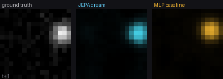
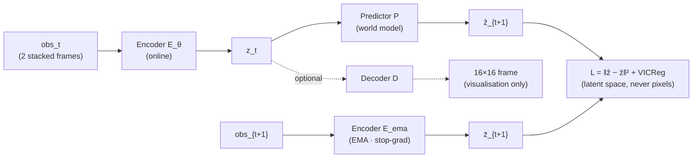

<div align="center">

# DVD-JEPA

### A tiny, reproducible **Joint-Embedding Predictive Architecture** world model — that learns the physics of a noisy bouncing DVD logo in representation space and dreams its future. Compared to a pixel-space autoencoder-model baseline with roughly same parameter count and compute budget.

[](LICENSE)



*Left: ground truth. Middle: JEPA dream — rolled forward in latent space and decoded to pixels. Right: MLP baseline — same parameter budget, but predicting directly in pixel space.*

</div>

> **Adapted from [mandarwagh9/dvd-jepa](https://github.com/mandarwagh9/dvd-jepa) by Mandar Wagh.** Contributions in this fork: Gaussian noise augmentation, code refactoring with consolidated configuration, and a revised comparison against a pixel-space baseline. Removed anomaly detection.

---

## Abstract

Most attempts to learn a **world model** from video try to predict the next frame pixel-by-pixel, and drown in detail that is fundamentally unpredictable. **JEPA** (Joint-Embedding Predictive Architecture, [LeCun 2022](#references)) makes a different bet: predict a *representation* of the future, not the pixels, and let the encoder discard whatever it cannot predict. The classic example is that of a self-driving car. We'd rather have the agent controlling the car spend most of its efforts on learning driving dynamics, instead of learning to predict the rustling of leaves in the wind

**DVD-JEPA** is a very small demonstration of that idea. The "world" is a DVD logo bouncing in a 16×16 box with added gaussian noise. A context encoder, an EMA target encoder, and a latent predictor are trained — with no labels and no decoder — to predict the next observation **in a 32-dimensional representation space**. We then show three things:

1. **It learned the world.** A linear probe recovers the logo's exact (y, x) position from the frozen 32-d latent to within **0.87 px** — though it was never given a coordinate.
2. **It can dream (once you add a decoder).** Bolt an optional decoder onto the frozen latents and roll the predictor forward: it renders a correct **future-frame video** of the bounce, including wall reflections, for ~20 steps before latent drift sets in.
3. **Latent-space prediction beats pixel-space prediction.** An autoencoder-style pixel-space baseline with an identical parameter and compute budget (~262k parameters, 2500 learning steps) that predicts frames directly in pixel space degrades 2.3× faster over a 30-step rollout than JEPA — confirming that the representational choice, not model capacity, is what matters.

It is a toy and it is also a correct, working instance of the idea behind I-JEPA, V-JEPA, and V-JEPA 2.

## The idea in one picture



## Why a bouncing logo?

It is a super simple system that still has the property that matters: The system is **completely predictable from two frames** (position + velocity → the underlying physics, bounces included). Gaussian noise on each frame means the exact pixel values are not predictable, so an effective architecture should for the most part ignore them if it is trying to learn the world dynamics. A context of two stacked frames is necessary and sufficient — exactly the spatio-temporal setup real video JEPAs use, minus a million hours of internet video.

## Method

| Component | Shape | Role |
|---|---|---|
| **Context encoder** `Eθ` | `2·16·16 → 256 → 128 → 32` | encodes an observation (2 stacked frames) to a latent |
| **Target encoder** `E_ema` | same, EMA of `Eθ`, stop-grad | produces the prediction target — the anti-collapse asymmetry |
| **Predictor** `P` | `32 → 64 → 32` | **the world model**: one step forward in latent space |
| **Decoder** `D` *(optional)* | `32 → 64 → 256 → 256` | readout head trained separately on the **frozen** target encoder; used to measure pixel-space error and visualise dreams |
| **MLP Baseline** | `2·16·16 → 256 → 256 → 256` | direct pixel-space prediction; same parameter budget (~262k) |

**Training objective.** Minimise the latent prediction error plus a variance term:

$$
\mathcal{L} = \bigl\| P\!\left(E_\theta(\text{obs}_t)\right) - \text{sg}\!\left(E_{\text{ema}}(\text{obs}_{t+1})\right) \bigr\|_2^2\;+\; \sum_d \text{ReLU}\!\left(1 - \text{std}(z_d)\right)
$$

The target encoder is an exponential moving average (`τ = 0.99`) of the online encoder with a stop-gradient — the [BYOL](#references) trick. Without the variance term the embedding collapses to a constant; with it, the embedding standard deviation holds at **~2.4–3.0** throughout training. The decoder is trained *separately* on the frozen encoder, so the JEPA does all the understanding and the decoder is only a readout.

## Results

All numbers are produced by `uv run python scripts/train.py` (seed 0) and saved to `assets/metrics.json`.

| Result | Value | What it shows |
|---|---:|---|
| Linear-probe position RMSE | **0.87 px** (box is 16 px) | the 32-d latent secretly encodes exact world state |
| JEPA forecast MSE, 1 step | **0.00054** | near-perfect short-horizon prediction |
| JEPA forecast MSE, 30 steps | **0.034** | graceful latent-rollout drift, not collapse |
| MLP baseline MSE, 1 step | 0.00613 | 11× worse than JEPA from the first step |
| MLP baseline MSE, 30 steps | 0.050 | 1.5× worse than JEPA at the horizon |
| JEPA mean MSE over 30 steps | **0.020** | vs. baseline mean **0.047** (2.3× worse) |
| Embedding std (collapse check) | **~3.0** (not 0) | the representation never collapsed |

## Reproduce

```bash
git clone <your-repo-url>
cd dvd-jepa
uv sync

uv run python scripts/train.py      # trains everything, writes checkpoints/ and assets/
```

## Repository layout

```
dvd_jepa/
  config.py    all hyperparameters and constants in one place
  world.py     the bouncing-logo environment and observation pair builder
  models.py    Encoder, Predictor, Decoder, MLPBaseline, variance term
  train.py     training functions and evaluation utilities (library, no main)
scripts/
  train.py     entry point: full training run, saves checkpoint and GIF
notebooks/     Jupyter/Colab notebook
assets/        rendered GIF and metrics.json
checkpoints/   trained PyTorch weights
```

## How this relates to real systems

DVD-JEPA is a toy, but every moving part has a full-scale counterpart:

- **I-JEPA** (images) and **V-JEPA / V-JEPA 2** (video) use exactly this predict-in-representation-space objective with an EMA target encoder, at ViT scale on real data.
- **V-JEPA 2-AC** makes the predictor *action-conditioned* and plans a real robot in latent space — the same "imagine the future, pick the best" loop, with actions added.
- The capability shown here — **forecast the next frames** — is exactly what a world model contributes to an egocentric-video data pipeline: predict what the person does next, and auto-surface the unexpected moment.

## Caveats

- **Latent rollout drifts** after ~20 steps: the predictor is trained for a single step, so errors compound. Multi-step rollout training or a recurrent predictor would extend the horizon.
- **Pixel-space comparison requires a decoder.** The decoder is trained separately on the frozen target encoder and is not part of the JEPA training loop. It exists to (a) render latent rollouts as frames for visual inspection, and (b) produce pixel-space MSE numbers so JEPA and the pixel-space baseline can be compared on the same scale. The linear probe — a single `32 → 2` linear layer trained on frozen embeddings — is how the latent's positional content is measured without a decoder.

## References

1. Y. LeCun. *A Path Towards Autonomous Machine Intelligence.* 2022.
2. M. Assran et al. *Self-Supervised Learning from Images with a Joint-Embedding Predictive Architecture (I-JEPA).* CVPR 2023.
3. A. Bardes et al. *Revisiting Feature Prediction for Learning Visual Representations from Video (V-JEPA).* 2024.
4. Meta AI. *V-JEPA 2: Self-Supervised Video Models Enable Understanding, Prediction and Planning.* 2025.
5. A. Bardes, J. Ponce, Y. LeCun. *VICReg: Variance-Invariance-Covariance Regularization for Self-Supervised Learning.* ICLR 2022.
6. J.-B. Grill et al. *Bootstrap Your Own Latent (BYOL).* NeurIPS 2020.

## Citation

```bibtex
@software{dvdjepa2026,
  title  = {DVD-JEPA: a tiny reproducible JEPA world model of a bouncing logo},
  author = {Wagh, Mandar},
  year   = {2026},
  url    = {https://github.com/mandarwagh9/dvd-jepa}
}
```

## License

MIT — see [LICENSE](LICENSE).
